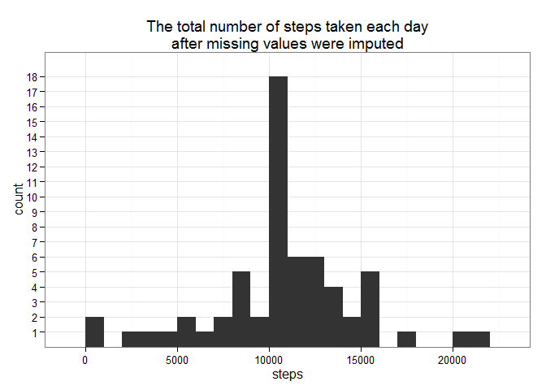

# Reproducible Research: Peer Assessment 1

By Renatas Narmontas  
Generated: 2014-07-20 13:30:45  
Version: R version 3.1.1 (2014-07-10)

## Global options

Loading required packages and setting global options.


```r
require(knitr)
```

```
## Loading required package: knitr
```

```r
require(ggplot2)
```

```
## Loading required package: ggplot2
```

```r
require(gridExtra)
```

```
## Loading required package: gridExtra
## Loading required package: grid
```

```r
require(reshape2)
```

```
## Loading required package: reshape2
```

```r
# echo always TRUE
opts_chunk$set(echo = TRUE, fig.path = 'figures/' )
# Avoiding scientific notation
options(scipen=3)
```

## Loading and preprocessing the data

**Task**:  
Show any code that is needed to  
1. Load the data (i.e. read.csv())  
2. Process/transform the data (if necessary) into a format suitable for your analysis  

**Solution**:  

Unzipping file "activity.zip".


```r
if (!file.exists("activity.csv")) {
    if (file.exists("activity.zip")) {
        unzip("activity.zip")
    }
}
```

Loading file "activity.csv".


```r
data <- read.csv("activity.csv")
head(data)
```

```
##   steps       date interval
## 1    NA 2012-10-01        0
## 2    NA 2012-10-01        5
## 3    NA 2012-10-01       10
## 4    NA 2012-10-01       15
## 5    NA 2012-10-01       20
## 6    NA 2012-10-01       25
```

Excluding NA data.


```r
data.without.NA <- data[!is.na(data$steps), ]
head(data.without.NA)
```

```
##     steps       date interval
## 289     0 2012-10-02        0
## 290     0 2012-10-02        5
## 291     0 2012-10-02       10
## 292     0 2012-10-02       15
## 293     0 2012-10-02       20
## 294     0 2012-10-02       25
```

```r
agg.data <- aggregate(steps ~ date, data.without.NA, sum)
head(agg.data)
```

```
##         date steps
## 1 2012-10-02   126
## 2 2012-10-03 11352
## 3 2012-10-04 12116
## 4 2012-10-05 13294
## 5 2012-10-06 15420
## 6 2012-10-07 11015
```

## What is mean total number of steps taken per day?

**Task**:  
For this part of the assignment, you can ignore the missing values in the dataset.  
1. Make a histogram of the total number of steps taken each day  
2. Calculate and report the mean and median total number of steps taken per day  

**Solution**:

Plotting histogram of the total number of steps taken each day. binwidth = every 1000 steps.


```r
ggplot(agg.data, aes(x=steps)) + geom_histogram(binwidth=1000) + scale_y_discrete(breaks = seq(1,10)) + theme_bw()
```

 

Calculating total mean and median of steps.


```r
tot.step.mean <- mean(agg.data$steps)
tot.step.mean
```

```
## [1] 10766
```

```r
tot.step.median <- median(agg.data$steps)
tot.step.median
```

```
## [1] 10765
```

The mean of total number of steps taken per day is **10766.1887**. The median of total number steps taken per day is **10765**.

## What is the average daily activity pattern?

**Task**:  
1. Make a time series plot (i.e. type = "l") of the 5-minute interval (x-axis) and the average number of steps taken, averaged across all days (y-axis)  
2. Which 5-minute interval, on average across all the days in the dataset, contains the maximum number of steps?

**Solution**:

Calculating and plotting average daily activity pattern.


```r
duom<-tapply(data.without.NA$steps, data.without.NA$interval, mean)
duom2<-melt(duom)
time.5.min <- c(0:287)
duom2 <- data.frame(duom2, time.5.min)
head(duom2)
```

```
##   Var1   value time.5.min
## 1    0 1.71698          0
## 2    5 0.33962          1
## 3   10 0.13208          2
## 4   15 0.15094          3
## 5   20 0.07547          4
## 6   25 2.09434          5
```

```r
ggplot(duom2, aes(x=time.5.min, y=value)) + 
    geom_line(lwd=.5) + 
    ggtitle("Average daily activity pattern") + 
    ylab("Steps (#)") + 
    xlab(NULL) + 
    scale_x_discrete(
        breaks = seq(0,287,36), 
        labels=c("00:00","03:00","06:00","09:00","12:00","15:00","18:00","21:00")) + 
    theme_bw()
```

 

```r
max.interval <- duom2[duom2$value == max(duom2$value),]$Var1
max.interval
```

```
## [1] 835
```

Maximum average number of steps is interval between **8:35** and **8:40**

## Imputing missing values

**Task**:  
1. Calculate and report the total number of missing values in the dataset (i.e. the total number of rows with NAs)  
2. Devise a strategy for filling in all of the missing values in the dataset. The strategy does not need to be sophisticated. For example, you could use the mean/median for that day, or the mean for that 5-minute interval, etc.  
3. Create a new dataset that is equal to the original dataset but with the missing data filled in.  
4. Make a histogram of the total number of steps taken each day and Calculate and report the mean and median total number of steps taken per day. Do these values differ from the estimates from the first part of the assignment? What is the impact of imputing missing data on the estimates of the total daily number of steps?  

**Solution**:  


```r
row.count <- nrow(data) - nrow(data.without.NA)
row.count
```

```
## [1] 2304
```

Total number of missing values in the dataset is **2304**.

Filling in all of the missing values with the mean for that 5-minute interval.


```r
data.recovered <- data
for (i in 1:nrow(data.recovered)) {
    if (is.na(data.recovered$steps[i])) {
        data.recovered$steps[i] <- duom2[duom2$Var1 == data.recovered$interval[i],]$value
    }
}
```

Aggregating and plotting histogram of the total number of steps taken each day. binwidth = every 1000 steps.


```r
agg.data <- aggregate(steps ~ date, data.recovered, sum)
head(agg.data)
```

```
##         date steps
## 1 2012-10-01 10766
## 2 2012-10-02   126
## 3 2012-10-03 11352
## 4 2012-10-04 12116
## 5 2012-10-05 13294
## 6 2012-10-06 15420
```

```r
ggplot(agg.data, aes(x=steps)) + geom_histogram(binwidth=1000) + scale_y_discrete(breaks = seq(1,20)) + theme_bw()
```

 

Calculating total mean and median of steps.


```r
tot.step.mean <- mean(agg.data$steps)
tot.step.mean
```

```
## [1] 10766
```

```r
tot.step.median <- median(agg.data$steps)
tot.step.median
```

```
## [1] 10766
```

The mean of total number of steps taken per day is **10766.1887**. The median of total number steps taken per day is **10766.1887**.

## Are there differences in activity patterns between weekdays and weekends?

**Task**:  
For this part the weekdays() function may be of some help here. Use the dataset with the filled-in missing values for this part.  
1. Create a new factor variable in the dataset with two levels - "weekday" and "weekend" indicating whether a given date is a weekday or weekend day.  
2. Make a panel plot containing a time series plot (i.e. type = "l") of the 5-minute interval (x-axis) and the average number of steps taken, averaged across all weekday days or weekend days (y-axis). The plot should look something like the following, which was creating using simulated data:

**Solution**:  

Creating a new factor variable.


```r
for (i in 1:nrow(data.recovered)) {
    day.level <- weekdays(as.Date(data.recovered$date[i]))
    if ( day.level %in% c("Monday", "Tuesday", "Wednesday", "Thursday", "Friday")) {
        data.recovered$day.level[i] <- c("Weekday")
    } else {
        data.recovered$day.level[i] <- c("Weekend")
    }
}
head(data.recovered)
```

```
##     steps       date interval day.level
## 1 1.71698 2012-10-01        0   Weekday
## 2 0.33962 2012-10-01        5   Weekday
## 3 0.13208 2012-10-01       10   Weekday
## 4 0.15094 2012-10-01       15   Weekday
## 5 0.07547 2012-10-01       20   Weekday
## 6 2.09434 2012-10-01       25   Weekday
```

Subsetting weekdays and weekends.


```r
weekdays <- data.recovered[data.recovered$day.level == "Weekday", ]
weekends <- data.recovered[data.recovered$day.level == "Weekend", ]
```

Calculating and plotting average daily activity pattern.


```r
duom.weekdays <- tapply(weekdays$steps, weekdays$interval, mean)
duom2.weekdays <- melt(duom.weekdays)
duom2.weekdays <- data.frame(duom2.weekdays, time.5.min)
duom.weekends <- tapply(weekends$steps, weekends$interval, mean)
duom2.weekends <- melt(duom.weekends)
duom2.weekends <- data.frame(duom2.weekends, time.5.min)

ggplot.1 <- ggplot(duom2.weekdays, aes(x=time.5.min, y=value)) + 
    geom_line(lwd=.5) + 
    ggtitle("Average daily activity pattern for weekdays") + 
    ylab("Steps (#)") + 
    xlab(NULL) + 
    scale_x_discrete(
        breaks = seq(0,287,36), 
        labels=c("00:00","03:00","06:00","09:00","12:00","15:00","18:00","21:00")) + 
    theme_bw()
ggplot.2 <- ggplot(duom2.weekends, aes(x=time.5.min, y=value)) + 
    geom_line(lwd=.5) + 
    ggtitle("Average daily activity pattern for weekends") + 
    ylab("Steps (#)") + 
    xlab(NULL) + 
    scale_x_discrete(
        breaks = seq(0,287,36), 
        labels=c("00:00","03:00","06:00","09:00","12:00","15:00","18:00","21:00")) + 
    theme_bw()
grid.arrange(ggplot.1, ggplot.2, ncol=1, nrow=2)
```

 

**Extra task**. Merging both graphs into one for better visualization.


```r
final.data <- merge(duom2.weekdays, duom2.weekends, by="time.5.min")
ggplot(final.data, aes(x=time.5.min)) +
    geom_line(aes(y=value.x, colour="weekday")) +
    geom_line(aes(y=value.y, colour="weekend")) +
    ggtitle("Merged average daily activity patterns") + 
    ylab("Steps (#)") + 
    xlab(NULL) + 
    scale_x_discrete(
        breaks = seq(0,287,36), 
        labels=c("00:00","03:00","06:00","09:00","12:00","15:00","18:00","21:00")) + 
    theme_bw() +
    scale_colour_discrete(name = "Type:") +
    theme(legend.justification=c(1,1), legend.position=c(1,1))
```

 

## Cleaning up

Removing data to free memory.


```r
rm(data, data.without.NA, data.recovered, agg.data, duom, duom2)
rm(weekdays, weekends, duom.weekdays, duom2.weekdays, duom.weekends, duom2.weekends, ggplot.1, ggplot.2)
rm(final.data)
```
